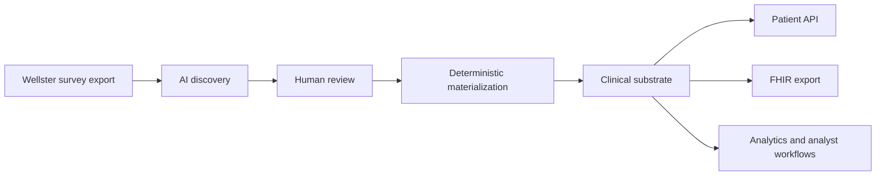
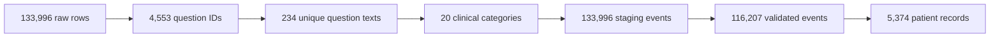
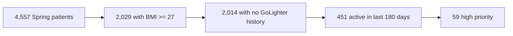
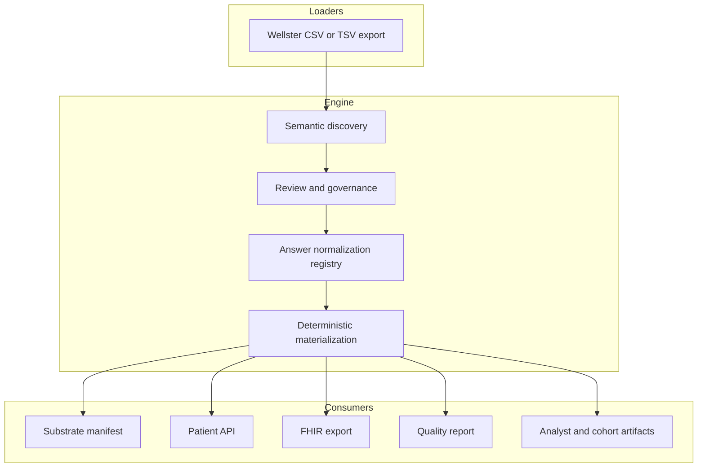
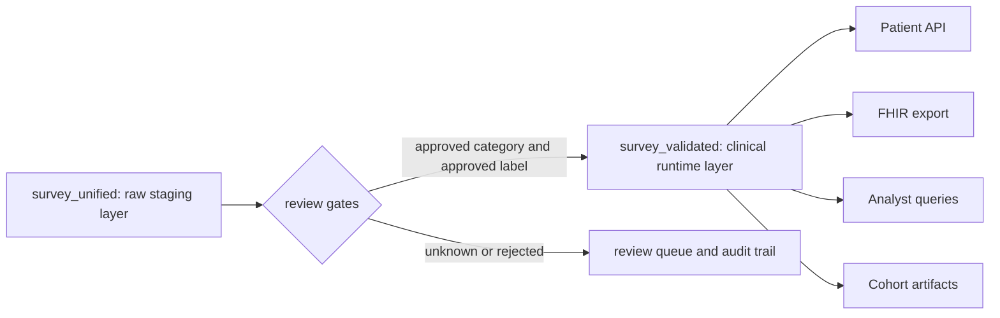
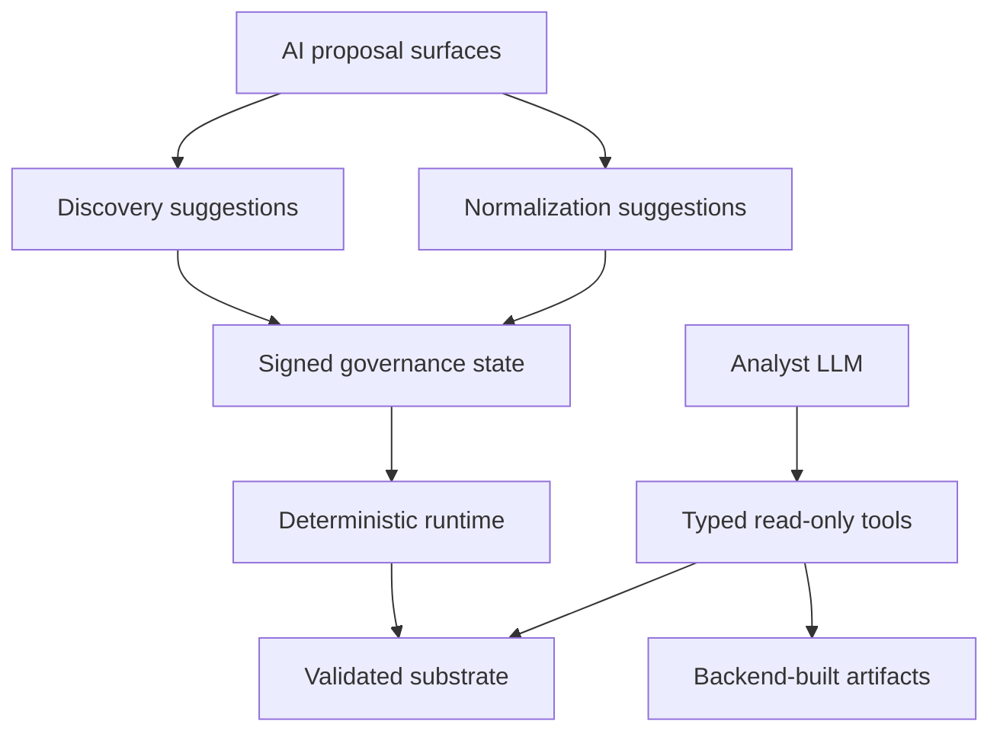

# UniQ Technical Deep-Dive for Wellster

This document explains how UniQ turns fragmented Wellster survey data into a
reviewed, queryable clinical substrate. It is written for a technical review:
what the engine does, where the trust boundary sits, how answer normalization is
controlled, and how Wellster could validate the substrate in a pilot.

## Executive Summary

UniQ is a Clinical Truth Layer beside your operational systems. It does not
replace Wellster databases; it materializes a reviewed layer that downstream
analytics, FHIR export, and analyst workflows can query consistently.

The core pattern is simple:

```text
AI proposes structure -> human review signs meaning -> deterministic code materializes the substrate
```

The important technical point: AI is used to discover semantic structure, not to
continuously reinterpret every row at runtime. Once mappings and normalization
decisions are signed, materialization is deterministic and auditable.

## If You Only Read 5 Minutes

- UniQ is a clinical truth layer beside Wellster's systems, not a replacement
  for them.
- AI proposes structure on unique patterns; Wellster's clinical/data review
  signs meaning; deterministic code applies it across all rows.
- Current materialized snapshot: **5,374 patients**, **116,207 validated
  clinical events**, **527 governed normalization records**, **19/19 chat eval**.
- The Spring -> GoLighter funnel in section 2 shows the operational payoff:
  4,557 Spring patients reduce to 59 high-priority screening candidates through
  a reproducible substrate query.
- The pilot review path is concrete: 60 minutes, live manifest, 5-10 known
  patients, normalization queue, FHIR sample, and one disposable retraction
  check.



## 1. Current Substrate Snapshot

The current Wellster snapshot is materialized and verifiable through the
substrate manifest:

```text
GET /v1/substrate/manifest
```

**Hero numbers**

- **Patient records:** 5,374
- **Validated survey events:** 116,207
- **Normalization registry records:** 527
- **Open unknown answer variants:** 217
- **Chat eval:** 19/19 passed

**Manifest detail**

- **Raw input rows:** 133,996
- **Raw question IDs:** 4,553
- **Unique English question texts:** 234
- **Clinical categories:** 20
- **Raw/staging survey events:** 133,996
- **Quality findings:** 1,041



The manifest records input hashes, mapping hashes, normalization hashes,
output-table hashes, validation coverage, chat-eval status, git commit, and
patient-retraction stats. It is the receipt for a substrate run.

## 2. Why It Matters: Cross-Brand Cohort Example

Once the reviewed substrate exists, cross-brand cohort logic becomes repeatable
instead of ad hoc analysis.

On the current substrate, the Spring -> GoLighter screening path computes:

**Current Spring -> GoLighter funnel**

- **Spring patients:** 4,557
- **BMI >= 27:** 2,029
- **No GoLighter history:** 2,014
- **Active in last 180 days:** 451
- **High priority:** 59



This is a deterministic join across validated brand history, current BMI state,
target-brand history, and recent activity. UniQ does not make the commercial or
clinical decision; it makes the cohort logic inspectable and repeatable.

## 3. Engine Architecture

The engine has three stages.



**Stage 1: Semantic discovery**

UniQ collapses repeated survey data into a smaller pattern layer:

```text
133,996 rows -> 4,553 question IDs -> 234 unique English question texts
```

AI is used on this pattern layer to propose clinical categories, semantic
labels, FHIR resource families, and canonical answer labels.

**Stage 2: Human review and governance**

The review layer captures what Wellster accepts as clinically meaningful.

- **Semantic categories:** 17 approved, 3 rejected
- **Answer-normalization records:** 527 approved
- **Unknown answer variants:** 217 open for review

Reviewer identity is captured through governance headers:

```text
X-Uniq-Reviewer
X-Uniq-Role
```

**Stage 3: Deterministic materialization**

After review, Pandas/DuckDB code applies the signed mappings across the full
dataset. Downstream clinical consumers read from the validated substrate layer.

## 4. Trust Model

The central trust boundary is `survey_unified` vs `survey_validated`.

**Where is the clinical truth?**

The clinical runtime surface is `survey_validated`. The raw/staging surface is
`survey_unified`.

`survey_unified`: raw/staging layer

- 133,996 rows
- all categories
- unknowns and rejected/nonclinical categories retained
- used for audit, debugging, and review

`survey_validated`: runtime clinical layer

- 116,207 rows
- approved categories only
- approved normalized labels only
- default surface for patient API, FHIR export, analyst queries, and cohort artifacts



**How are answer values trusted?**

Answer normalization is stored as reviewable records, not as a flat string map:

```json
{
  "id": "norm-...",
  "category": "CURRENT_MEDICATIONS",
  "original_value": "L-thyroxin",
  "canonical_label": "LEVOTHYROXINE",
  "review_status": "approved",
  "source_count": 12,
  "first_seen": "2026-...",
  "last_seen": "2026-..."
}
```

Current queue state:

- **Total unknown entries seen:** 338
- **Open:** 217
- **Promoted into registry:** 121
- **Dismissed:** 0

Unknown answer variants are not silently trusted. They remain visible for review
while the validated layer stays limited to reviewed semantics.

**How do you bound AI drift and hallucination?**



There are three AI surfaces:

- **Discovery AI:** runs on unique question/answer patterns; output is reviewed and persisted.
- **Answer-normalization AI:** proposes labels; registry review state decides runtime trust.
- **Analyst LLM:** read-only tools, typed tool schemas, backend-resolved artifacts.

The analyst cannot mutate the substrate. SQL is guarded against DDL/DML,
stacked statements, file/network table functions, `ATTACH`, `COPY`, and
`PRAGMA`. Tool inputs are Pydantic-validated, and final artifacts are built by
backend code.

**How can Wellster verify what was exported?**

Every materialization run writes a manifest with input hash, mapping hash,
normalization hash, output-table hashes, validation coverage, chat-eval status,
active retraction count, git commit, and generated timestamp. A later run can be
compared through those hashes.

## 5. Healthcare Data Controls

The pilot surface is designed around the controls a German healthcare data team
will ask for first: traceability, reviewer attribution, right-to-erasure
handling, and separation between raw source data and reviewed clinical
substrate.

**GDPR (DSGVO) Art. 17: right to erasure**

Patient retraction is implemented at the materialized-output layer:

- removes patient rows from materialized CSV/JSON outputs;
- removes clinical annotations for that patient;
- writes a tombstone so future pipeline runs do not re-expose the patient;
- makes `/patients/{id}` return 404;
- makes `/export/{id}/fhir` and `/v1/export/{id}/fhir` return 404;
- re-applies active tombstones during later materialization runs.

Tombstones store a server-secret HMAC-SHA256 of `user_id`, not the plain patient
ID. This is pseudonymization, not anonymization.

**Reviewer attribution**

Governance writes carry reviewer identity via `X-Uniq-Reviewer` and
`X-Uniq-Role`. This covers mapping review, normalization review, and clinical
annotations.

**FHIR export**

FHIR export is available per patient:

```text
GET /export/{id}/fhir
GET /v1/export/{id}/fhir
```

Example:

```text
GET /v1/export/383871/fhir
```

returns:

```text
23 FHIR resources
1 Patient
11 Observations
11 MedicationStatements
```

The export path runs an internal smoke validator before returning the bundle.
This is not a formal HL7 certification claim; it is a structural check for the
pilot export surface.

**Healthcare governance context**

UniQ does not claim formal ePA, EHDS, or GDNG certification in this document.
The architecture is built to make provenance, auditability, and data-reuse
boundaries inspectable.

**Hosting assumption for pilot**

The pilot should run in a dedicated EU environment with encrypted storage,
restricted admin access, and hosting model finalized during pilot setup.

## 6. Operational Surfaces

The substrate exposes several bounded operational surfaces. These are consumers
of the reviewed substrate, not independent sources of clinical truth.

**Quality monitoring**

`quality_report.csv` is materialized on each run. Current checks include BMI
spikes, BMI gaps, undocumented medication switches, subscription lapses, and
suspicious BMI values.

Current output:

```text
quality_report rows: 1,041
```

Example findings:

- **warning / `bmi_spike`:** BMI changed by 5.8 points between measurements.
- **warning / `bmi_gap`:** Patient has 370 day tenure but no BMI recorded.
- **info / `undocumented_switch`:** Medication switch: Mounjaro -> Wegovy.

**Clinical annotations**

Clinician write-back is supported through `clinical_annotations`. Notes can be
pinned to patient-level or event-level context and carry reviewer identity. This
turns the substrate from a one-time export into operational memory: reviewed
context can be added back to the patient record without editing upstream source
systems.

**Analyst surface**

The analyst surface is a controlled query-and-artifact layer. It can produce
cohort trends, alerts tables, patient records, FHIR bundles, generic tables, and
opportunity lists. The cross-brand funnel in section 2 is one example: the
analyst requests the artifact, but deterministic backend logic computes the
cohort against `survey_validated`.

**Verification coverage**

Current focused checks:

- **Query guardrail tests:** 7/7
- **Chat agent tests:** 5/5
- **Chat eval:** 19/19
- **Retraction tests:** 7/7

## 7. Pilot Review Checklist

For a technical review, we suggest validating the system in this order:

1. **Manifest:** inspect `/v1/substrate/manifest` for row counts, hashes,
   validation coverage, eval status, and active retractions.
2. **Trust boundary:** compare `survey_unified` and `survey_validated`.
3. **Normalization depth:** inspect `/v1/normalization/unknown` and review the
   217 open answer variants.
4. **Patient truth check:** pick 5-10 known patients and compare UniQ output
   against Wellster source truth.
5. **FHIR check:** export FHIR for those patients and inspect resource shape.
6. **Retraction check:** run one deletion on a disposable output copy and verify
   patient/FHIR 404 behavior.
7. **Cohort check:** reproduce the Spring -> GoLighter funnel and inspect the
   filter path.

This can be done as a 60-minute technical walkthrough. We bring the manifest
live, validate selected patients with your team, inspect the normalization
queue, and align pilot scope around the review depth Wellster wants.

**What we want to learn from your team**

- Are `survey_unified` and `survey_validated` the right trust boundary for your
  workflow?
- Are 217 open unknown answer variants a reasonable review backlog, or would
  Wellster prefer stricter ingestion gating?
- Which FHIR profiles, value-coding expectations, or ePA/EHDS roadmap items
  matter most for your data team?
- Where should Wellster sit on the HITL spectrum: review every label, review
  unknowns only, or use confidence thresholds after onboarding?
- Which source should join the substrate next if the survey pilot is successful?

## 8. Expansion Path

The current implementation is focused on Wellster survey CSV/TSV data. The
governance pattern is reusable, but each new source still needs explicit
engineering work:

- a loader for the source format;
- an entity mapping into the substrate shape;
- a discovery prompt appropriate to the source;
- a review surface for clinician/data-team validation;
- deterministic materialization logic;
- tests and manifest coverage.

Example: adding clinical notes would require an NLP loader, an entity-mapping
spec for note-derived findings, a note-specific discovery prompt, and a review
surface that shows the source note next to the proposed normalized fact.

The first pilot focus is narrower: prove that Wellster's fragmented survey data
can be converted into a reviewed, auditable, queryable clinical substrate.
